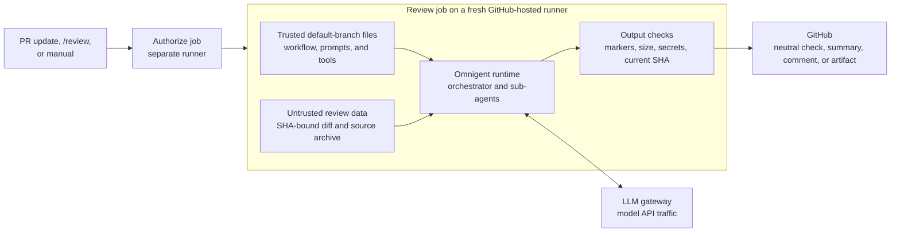
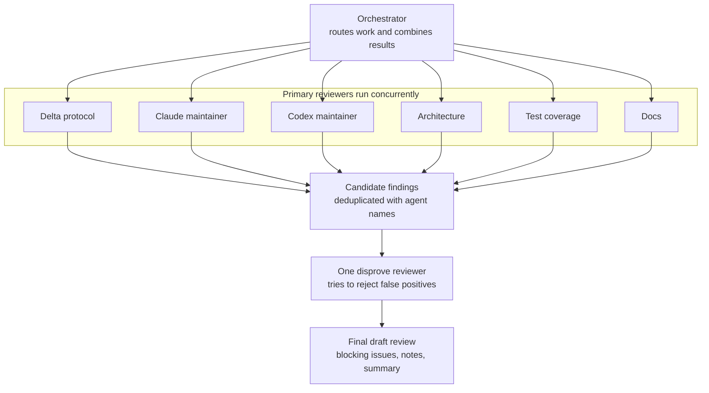
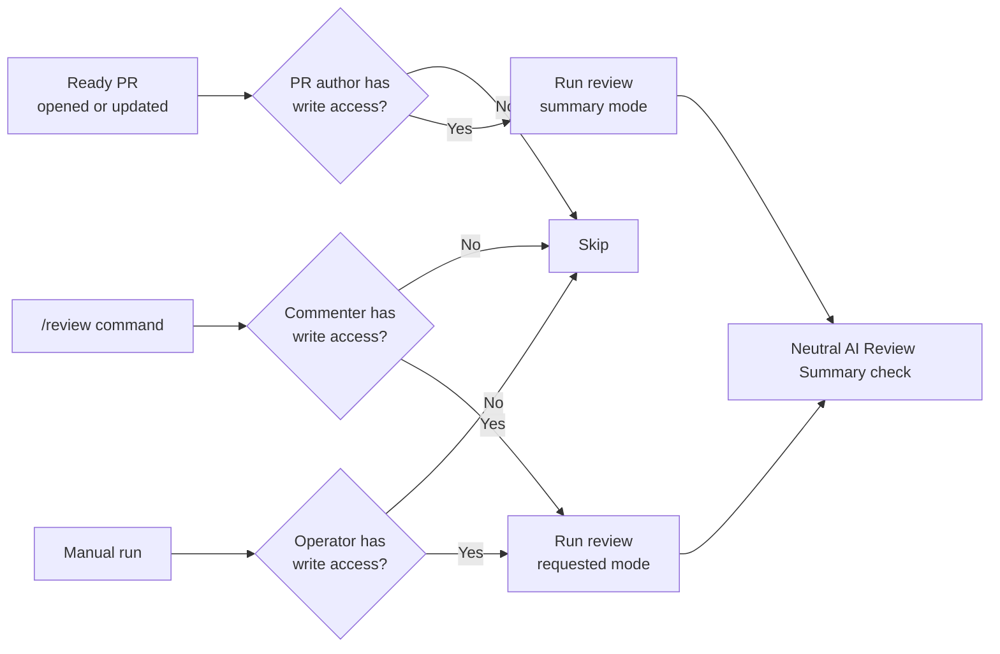
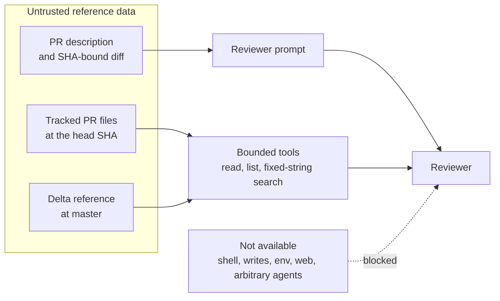
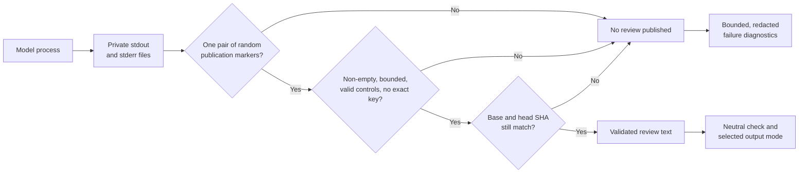
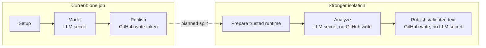

# AI pull request review

This workflow gives maintainers a draft second opinion on a pull request. It does not approve a
PR, merge code, or replace human review. It is experimental and non-blocking.

After a small authorization job, the model review runs in one fresh GitHub-hosted runner. Omnigent
is a process on that runner, not a separate server. Its model requests go through the configured
LLM gateway.

## How a review moves through the system

The trusted checkout contains the workflow and reviewer definitions from the default branch. The
PR archive is separate. Reviewers can read it through three narrow tools, but the workflow never
builds or executes it.

The runner also checks out `delta-io/delta` at `master` as reference material. Reviewers can read
the protocol specification, Delta Spark code, and protocol RFCs from that checkout. Nothing from
that repository is executed. Tracking `master` keeps the reference current. The reproducibility
trade-off is covered under Known limits.

Once the inputs are ready, Omnigent splits the review by subject.

## Inside Omnigent

The orchestrator can send work only to the agents checked into
[`omnigent/reviewer/agents`](omnigent/reviewer/agents). It cannot load an agent supplied by the PR.
Each dispatch receives the same workflow-built metadata and diff. The policy in
[`review_context_policy.py`](omnigent/review_context_policy.py) adds that context mechanically and
rejects the dispatch if the context is missing.

The disprove reviewer receives all candidate findings in one batch. It confirms, rejects, or
downgrades each claim before the orchestrator writes the final review. Every published finding
names the agents that raised it and suggests a concrete fix.

## Models and harnesses

A harness is the client Omnigent uses to call a model. Model names come from repository Actions
variables; the workflow has no built-in model fallback.

| Role | Harness | Model variable |
| --- | --- | --- |
| Orchestrator, protocol, architecture, tests, docs | Claude SDK | `MODEL` |
| Claude maintainer | Claude SDK | `CLAUDE_MAINTAINER_MODEL` |
| Codex maintainer | Codex | `CODEX_MAINTAINER_MODEL` |
| Disprove reviewer | Codex | `DISPROVE_MODEL` |

All roles use `LLM_API_KEY` and `GATEWAY_BASE_URL`. `GATEWAY_HOST` is the bare hostname used by the
runner's network allowlist. The key and base URL are repository secrets; host and model names are
repository variables. An optional GitHub App ID and private key let review comments appear under a
named bot.

## Triggers and output

The same review pipeline can start three ways.

| Trigger | Who is checked | Default output |
| --- | --- | --- |
| Ready, non-draft PR opened or updated | PR author must have write, maintain, or admin access | Actions summary |
| `/review [mode]` on a PR | Comment author must have write, maintain, or admin access | Artifact |
| Manual workflow run | Person starting the run must have write, maintain, or admin access | Selected mode |

Modes are `artifact`, `summary`, `collapsed`, and `comment`. Artifact output is retained for seven
days. Collapsed and comment modes write on the PR. Every authorized run that collects PR context
also creates an `AI Review Summary` check on the reviewed commit. That check is always neutral, so
it is not an approval or a merge gate. The workflow itself should not be added to the repository's
required checks.

Only the trusted default-branch workflow runs for `pull_request_target` and `/review` events. A
change to this workflow in a PR does not take effect for those events until it merges. A manual run
uses the selected branch, so operators should select a trusted branch.

## What the reviewers can access

Regardless of the trigger, reviewers receive the PR description and up to 80,000 bytes of diff in
their prompt. For surrounding context they have three local tools:

- `read_source_file` reads line-numbered text.
- `list_source_files` lists tracked files below a path.
- `search_source_code` performs a fixed-string search.

The tools can read the exact PR source archive or the Delta reference checkout. They reject absolute
paths, `..`, `.git`, symlinks, binary files, and paths outside those roots. File size, output size,
and search work are bounded. Reviewers have no shell, file-write, environment-variable, arbitrary
agent-spawn, or web-search tools.

## Security controls

PR content is untrusted data. No PR file is executed or treated as instructions.

| Risk | Control |
| --- | --- |
| A PR changes the reviewer and triggers itself | Automatic and `/review` runs load the trusted default-branch workflow. |
| A PR runs code with the LLM key | The runner downloads a GitHub source archive and never executes PR files. |
| Prompt injection asks for shell or secrets | Native Claude and Codex tools and host skills are disabled; runtime preflight checks this. |
| The orchestrator launches a PR-supplied agent | Unrestricted spawning is off, and `sys_session_send` accepts only the checked-in roster. |
| A sub-agent gets a placeholder instead of the real diff | A guardrail appends the SHA-bound context to every dispatch and fails closed without it. |
| An agent reads runner files | Source tools confine reads to the PR and Delta roots and enforce path and size limits. |
| Dependencies change without review | Actions are pinned by commit SHA, Python installs require hashes, and Node uses `npm ci` with a lockfile. |
| Model text injects runner commands or leaks raw logs | Output goes to files first. Only text between random per-run markers is eligible to publish. |
| A named-bot token reaches the model | The workflow mints the GitHub App token only after model execution and output validation. |
| The PR changes while review is running | The workflow compares the current base and head SHAs with the reviewed SHAs before publication. |
| Model traffic reaches an arbitrary host | Harden Runner blocks outbound traffic except an explicit allowlist that includes the LLM gateway. |

The workflow checks output length and control characters and refuses to publish the exact LLM key.
On failure, diagnostics are redacted and bounded before they reach the Actions log. These checks are
a backstop, not a reason to give reviewers broader tools.

## Known limits

The model and publication steps still share one GitHub Actions job. That job needs the LLM secret
and GitHub write scopes for checks and optional comments. Reviewers cannot reach the token with
their current tool set, but separate analysis and publication jobs would make the boundary stronger.

The same job installs dependencies and publishes results, so its network allowlist includes GitHub,
npm, and PyPI endpoints in addition to the LLM gateway. Splitting setup, model execution, and
publication would let the model step allow only the gateway. Both changes are tracked by the TODO in
[`workflows/ai-review.yml`](workflows/ai-review.yml).

The Delta reference follows `master`. Review agents can access it only through read-only tools, and
no workflow step executes its contents. Its contents can still change between reviews. The open
design choice is whether freshness or exact reproducibility matters more here.

## Common questions

### Does this run code from the PR?

No. It downloads the tracked files at the PR head SHA for reading. It does not check out and execute
the PR's workflow, scripts, build files, or Rust code.

### Does it block a merge?

No. The published check is neutral, and this workflow is not intended to be a required check. A
failed run may still appear in the PR's check list as useful diagnostic noise.

### Why can't a PR test its own workflow change automatically?

Automatic and `/review` runs use the workflow from the default branch. This prevents a PR from
changing the reviewer and immediately running that change with repository secrets. The changed
workflow starts handling those events after it merges.

### Is the reviewer included in the Delta Kernel binary?

No. The workflow, prompts, Python tools, and dependency lockfiles live under `.github/`. Cargo does
not compile or package them into any Rust crate.

## Source map

- [`workflows/ai-review.yml`](workflows/ai-review.yml): trigger, authorization, runner setup, and
  publication
- [`omnigent/reviewer/REVIEW.md`](omnigent/reviewer/REVIEW.md): orchestrator instructions and output
  contract
- [`omnigent/reviewer/agents`](omnigent/reviewer/agents): specialist review instructions and
  harness choices
- [`omnigent/review_context_policy.py`](omnigent/review_context_policy.py): mandatory context
  injection
- [`omnigent/source_context.py`](omnigent/source_context.py): bounded read-only source access
- [`omnigent/requirements.txt`](omnigent/requirements.txt) and
  [`omnigent/package-lock.json`](omnigent/package-lock.json): pinned runtime dependencies
