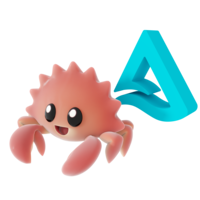

# Delta Kernel Rust User Guide

<span style="display:block;text-align:center">
  
 </span>

Delta Kernel is a Rust library for building Delta Lake connectors. It handles the
Delta protocol so you don't have to. Connectors read and write Delta tables through
Kernel's API without needing to understand the protocol internals. When the protocol
evolves, updating your Kernel dependency is all that's needed to pick up new features.

Kernel is query-engine agnostic. It provides a native Rust API and a C/C++ FFI layer,
making it usable from virtually any language.

> [!NOTE]
> This guide is a work in progress.

## Architecture at a glance

```text
     ┌──────────────────────────────────────────┐
     │                Connectors                │
     │  (Query Engines, Analytics Tools, etc.)  │
     └───────────┬──────────────────────┬───────┘
                 │                      │
     ┌───────────▼─────────┐   ┌────────▼───────┐
     │    Rust Bindings    │   │  FFI Bindings  │
     │  (Native Rust API)  │   │  (C/C++ API)   │
     └────────────────┬────┘   └─┬──────────────┘
                      │          │
                  ┌───▼──────────▼─┐
                  │  Delta Kernel  │
                  │  (core logic)  │
                  └───────┬────────┘
                          │ calls into
                  ┌───────▼────────┐
                  │  Engine trait   │
                  │  (abstraction)  │
                  └───────┬────────┘
                          │ implemented by
                  ┌───────▼────────┐
                  │  DefaultEngine │
                  │  (or custom)   │
                  └───────┬────────┘
                          │
                  ┌───────▼────────┐
                  │  Delta Table   │
                  │  (storage)     │
                  └────────────────┘
```

The **Engine trait** is the boundary between Kernel and your connector. Kernel defines
_what_ needs to happen (read JSON, read Parquet, evaluate expressions); the engine
defines _how_. A batteries-included `DefaultEngine` is provided for common use cases.
See [Architecture Overview](./concepts/architecture.md) for details.

## Key APIs

**Snapshot** is a point-in-time view of a Delta table. Every operation starts here:
reading the schema, scanning data, or starting a Transaction.

**Scan** reads data from a table. It supports predicate pushdown for file skipping and
column projection. See [Building a Scan](./reading/building_a_scan.md).

**Transaction** writes data to a table. It supports creating tables, blind appends, and
committing changes atomically. See [Creating a Table](./writing/create_table.md) and
[Appending Data](./writing/append.md).

**CheckpointWriter** compacts the transaction log into a checkpoint for faster reads.
See [Checkpointing](./maintenance/checkpointing.md).

### Data types and schema

Kernel defines its own protocol-compliant type system, independent of any engine's type
system. This includes primitive types (integers, strings, timestamps, decimals, etc.) and
complex types (structs, arrays, maps). The Kernel schema is the source of truth for a
table's structure. Your engine converts to and from it as needed.

## FFI layer

The `delta_kernel_ffi` crate exposes the full Kernel API to C and C++ via a stable FFI
boundary. Headers (`.h` and `.hpp`) are generated automatically at build time using
cbindgen. Rust objects cross the boundary as opaque **handles** with clear ownership
semantics, and every fallible function returns a structured error type.

This means you can build a Delta connector in C, C++, or any language with a C FFI
without writing any Rust. See the [FFI overview](./ffi/overview.md) for details.

## Design principles

1. **Protocol abstraction.** Kernel encapsulates the Delta protocol. Connectors pick up
   new protocol features by updating their Kernel dependency.
2. **Engine-agnostic.** Kernel defines _what_ to do; engines define _how_. The `Engine`
   trait is the only integration point.
3. **Feature flag modularity.** Core functionality works without optional dependencies.
   Pay only for what you use via Cargo feature flags.
4. **Clear I/O boundaries.** APIs clearly indicate when I/O operations occur, giving
   connectors control over scheduling and parallelism.

## Crate structure

| Crate | Purpose |
|-------|---------|
| `delta_kernel` | Core library: protocol logic, table operations, trait definitions, default engine |
| `delta_kernel_ffi` | C/C++ FFI bindings ([overview](./ffi/overview.md)) |
| `delta_kernel_derive` | Procedural macros for internal code generation |
| `acceptance` | Delta Acceptance Tests (DAT) validation suite |
| `benchmarks` | Performance benchmarks for the core library |
| `delta-kernel-unity-catalog` | Unity Catalog integration ([overview](./unity_catalog/overview.md)) |
| `unity-catalog-delta-rest-client` | REST client for the Unity Catalog API |

## Getting started

For Rust projects, add to `Cargo.toml`:

```toml
delta_kernel = { version = "0.21", features = ["default-engine-rustls", "arrow"] }
```

For C/C++ projects, build the FFI crate and link against it. See the
[FFI overview](./ffi/overview.md).

Then follow the quick starts to see Kernel in action.

## What's next

- [Quick Start: Reading a Table](./getting_started/quick_start_read.md)
- [Quick Start: Writing a Table](./getting_started/quick_start_write.md)
- [Architecture Overview](./concepts/architecture.md)
