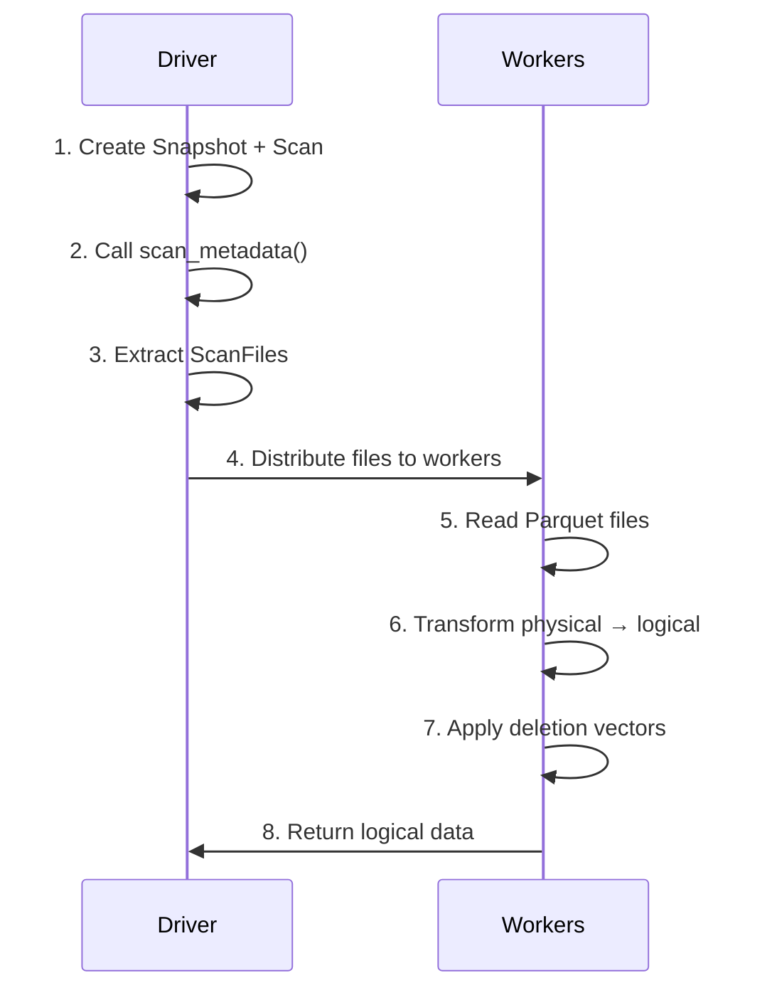

# Advanced reads with scan_metadata()

To control when and how data files are read, you can use `scan.scan_metadata()` instead of
`scan.execute()`. This method gives you access to the file list and metadata without reading the
actual Parquet files, so you can decide where and how to perform the I/O. This API provides a
path for building connectors for distributed compute engines (Spark, Flink, etc.) where data reads
may happen in parallel.

Before reading this page, make sure you understand [Building a Scan](./building_a_scan.md).

> [!NOTE]
> `scan_metadata()` parallelizes data reads but not log replay. To parallelize log replay as
> well, see [Distributed Log Replay](./parallel_scan_metadata.md).

## Example pattern

The execution flow below illustrates how one might implement parallel data reads using
`scan_metadata()`:



For a complete working example of multi-threaded reads, see the
[read-table-multi-threaded](https://github.com/delta-io/delta-kernel-rs/tree/main/kernel/examples/read-table-multi-threaded)
example in the kernel repository.

## Enumerating ScanFiles

`scan_metadata()` returns an iterator of `ScanMetadata`. Each `ScanMetadata` represents a batch of
files that need to be read for the scan. You can then use `visit_scan_files` on each `ScanMetadata`
to extract each file (represented as a `ScanFile`) in the batch.

For example:
```rust,no_run
# extern crate delta_kernel;
# use delta_kernel::scan::state::ScanFile;
# use delta_kernel::{DeltaResult, Engine};
# fn perform_read(_chunk: &[ScanFile]) {}
# fn example(scan: &delta_kernel::scan::Scan, engine: &dyn Engine) -> DeltaResult<()> {
fn collect_files(files: &mut Vec<ScanFile>, file: ScanFile) {
    files.push(file);
}

let mut all_files: Vec<ScanFile> = vec![];
for metadata in scan.scan_metadata(engine)? {
    let metadata = metadata?;
    all_files = metadata.visit_scan_files(all_files, collect_files)?;
}

// Now distribute these files across threads, tasks, or remote workers
let num_workers = 4;
let chunk_size = (all_files.len() / num_workers).max(1);
for chunk in all_files.chunks(chunk_size) {
    perform_read(chunk);
}
# Ok(())
# }
```

It is preferred to use `visit_scan_files` to iterate through each `ScanFile`. However if you need
raw access to the set of files as an `EngineData`, each `ScanMetadata` contains:
- **`scan_files`**: a `FilteredEngineData` with one row per file to read, plus a selection
  vector indicating which rows are active (rows excluded by **data skipping** are marked
  inactive, so that files which can't match the scan's predicate will be filtered out).
- **`scan_file_transforms`**: a `Vec<Option<ExpressionRef>>` with a per-file transformation
  expression. If present, this expression must be applied to the physical data to produce the
  correct logical output (e.g., injecting partition column values, applying column mapping).

## ScanFile

A `ScanFile` contains everything needed to read one data file:

```rust,ignore
pub struct ScanFile {
    pub path: String,                              // relative to table root
    pub size: i64,                                 // file size in bytes
    pub modification_time: i64,                    // millis since epoch
    pub stats: Option<Stats>,                      // parsed statistics
    pub dv_info: DvInfo,                           // deletion vector info
    pub transform: Option<ExpressionRef>,          // physical -> logical transform
    pub partition_values: HashMap<String, String>,  // partition column values
}
```

In a distributed engine, for example, you could serialize the `ScanFile` data along with
the scan's `physical_schema()` and `logical_schema()`, then ship them to workers. Or in
a multi-threaded engine, you can send them through in-memory channels.

## Reading and transforming data

Once a worker has a `ScanFile`, it should read the Parquet file and apply transformations to
produce logical data.

### Reading the Parquet file

Resolve the file path against the table root and read with the physical schema:

```rust,ignore
let file_url = scan.table_root().join(&scan_file.path)?;
let size: u64 = scan_file.size.try_into().map_err(|_| Error::generic("negative file size"))?;
let file_meta = FileMeta::new(file_url, scan_file.modification_time, size);

let read_results = engine
    .parquet_handler()
    .read_parquet_files(&[file_meta], physical_schema.clone(), None)?;
```

### Transforming physical data to logical

Each file may need a per-file transform to convert the physical Parquet data into the
logical schema that the scan requested. The transform handles:

- **Partition value injection**: partition columns are not stored in the Parquet file.
  The transform adds them from the file's metadata.
- **Column mapping**: if the table uses column mapping, the transform renames physical
  columns to their logical names.
- **Schema evolution**: if the file was written with an older schema, the transform fills
  in missing columns with nulls.

Use `transform_to_logical`:

```rust,ignore
use delta_kernel::scan::state::transform_to_logical;

let physical_schema = scan.physical_schema();
let logical_schema = scan.logical_schema();

for batch in read_results {
    let physical_data = batch?;
    let logical_data = transform_to_logical(
        &engine,
        physical_data,
        physical_schema,
        logical_schema,
        scan_file.transform.clone(),
    )?;
    // logical_data now has the columns the scan requested
}
```

> [!WARNING]
> If `ScanFile.transform` is present, you must apply it before returning data. Omitting the
> transform produces incorrect output — missing partition columns, wrong logical names, or nulls
> where data should appear. If `transform` is `None`, the physical data already matches the
> logical schema and no transformation is needed.

### Applying deletion vectors

Delta tables can use **deletion vectors** to mark rows as logically deleted without
rewriting entire data files. If a file has a deletion vector, you must filter out those
rows. Call `DvInfo::get_selection_vector()` on the `ScanFile.dv_info` to get a boolean mask:

```rust,ignore
let selection_vector = scan_file
    .dv_info
    .get_selection_vector(&engine, scan.table_root())?;

let filtered = if let Some(sv) = selection_vector {
    logical_data.apply_selection_vector(sv)?
} else {
    // No deletion vector, so all rows are valid
    logical_data
};
```

#### Getting deleted row indexes

If your engine works with row indexes rather than boolean masks, `DvInfo` also provides
`get_row_indexes()`. This method returns a `Vec<u64>` containing the indexes of rows that
should be _removed_ from the result set:

```rust,ignore
let deleted_rows = scan_file
    .dv_info
    .get_row_indexes(&engine, scan.table_root())?;

if let Some(indexes) = deleted_rows {
    // indexes contains the positions of deleted rows (e.g., [2, 17, 42])
    // Use these to filter rows out of the result set
}
```

Choose `get_selection_vector()` when your engine applies boolean masks directly (for example,
Arrow's `filter` kernel). Choose `get_row_indexes()` when your engine removes rows by
position, or when the deletion vector is sparse and you want to avoid allocating a boolean
vector with one entry per row.

## Accessing scan schemas

When you read Parquet files yourself (instead of using `scan.execute()`), you need to know
the schemas and predicate to pass to the Parquet reader. `Scan` exposes three methods for this.

### Physical schema

`Scan::physical_schema()` returns the schema of the underlying data files. This is the
schema you pass to the Parquet reader when opening files. It can differ from the logical
schema because partition columns are stored in the Delta log metadata, not in the Parquet
files themselves.

```rust,ignore
let physical_schema = scan.physical_schema();
// Pass this to engine.parquet_handler().read_parquet_files(...)
```

### Logical schema

`Scan::logical_schema()` returns the output schema of the scan — the schema your engine
sees after all transforms have been applied. Pass this to `transform_to_logical` and
serialize it alongside `physical_schema` and each `ScanFile` when distributing work to
remote workers.

```rust,ignore
let logical_schema = scan.logical_schema();
// Pass this to transform_to_logical(...)
```

### Physical predicate

`Scan::physical_predicate()` returns the scan's predicate rewritten in terms of physical
column names. If the table uses column mapping, logical column names in the original
predicate are translated to the physical names stored in the Parquet files. This is the
predicate you can push down into the Parquet reader for row-group filtering.

```rust,ignore
if let Some(predicate) = scan.physical_predicate() {
    // Push this predicate into the Parquet reader for row-group skipping
}
```

If the scan has no predicate, this returns `None`.

> [!TIP]
> When distributing work to remote workers, serialize the physical schema, logical schema,
> physical predicate, and the `ScanFile` data together. Workers need all four to read files
> correctly.

## What's next

- [Column Selection](./column_selection.md): projecting specific columns
- [Distributed Log Replay](./parallel_scan_metadata.md): distributing log replay for large tables
- [Filter Pushdown and File Skipping](./filter_pushdown.md): predicate-based optimization
