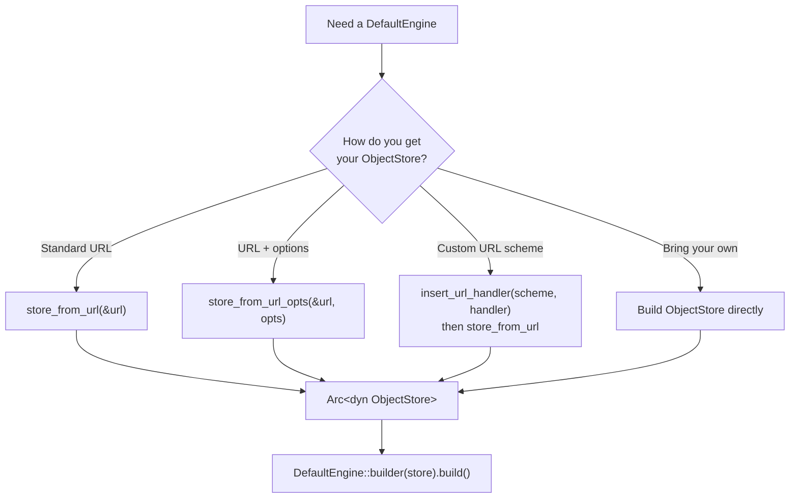

# Configuring storage

To configure how `DefaultEngine` accesses your Delta tables, you create an object store
from a URL and pass it to the engine builder. The `DefaultEngine` uses the
[`object_store`](https://docs.rs/object_store) crate for all storage I/O, supporting
local files, S3, GCS, and Azure out of the box.

Before reading this page, make sure you understand
[The Engine Trait](../concepts/engine_trait.md).

> [!NOTE]
> The storage APIs on this page require one of the `default-engine` feature flags
> (`default-engine-rustls` or `default-engine-native-tls`).
> See [Feature Flags](../concepts/feature_flags.md) for details.

Kernel provides several paths to construct an object store, depending on how
much control you need:



## Standard URL

`store_from_url` creates an object store from a URL. The `object_store` crate detects
the storage backend from the URL scheme:

```rust,no_run
# extern crate delta_kernel;
# extern crate url;
# use std::sync::Arc;
# use url::Url;
# use delta_kernel::engine::default::DefaultEngine;
# use delta_kernel::engine::default::storage::store_from_url;
# use delta_kernel::DeltaResult;
# fn main() -> DeltaResult<()> {
let url = Url::parse("file:///path/to/table")?;
let store = store_from_url(&url)?;
let engine = DefaultEngine::builder(store).build();
# Ok(())
# }
```

## URL with options

To pass provider-specific options (credentials, region, endpoint, etc.), use
`store_from_url_opts`. These options are forwarded directly to the `object_store` crate:

```rust,no_run
# extern crate delta_kernel;
# extern crate url;
# use std::collections::HashMap;
# use url::Url;
# use delta_kernel::engine::default::DefaultEngine;
# use delta_kernel::engine::default::storage::store_from_url_opts;
# use delta_kernel::DeltaResult;
# fn main() -> DeltaResult<()> {
let url = Url::parse("s3://my-bucket/path/to/table")?;
let options = HashMap::from([
    ("region", "us-west-2"),
    ("access_key_id", "AKIA..."),
    ("secret_access_key", "..."),
]);
let store = store_from_url_opts(&url, options)?;
let engine = DefaultEngine::builder(store).build();
# Ok(())
# }
```

See the [`object_store` documentation](https://docs.rs/object_store) for the full list
of supported options per storage provider.

## Custom URL schemes

If you need to support a URL scheme that `object_store` doesn't handle natively (e.g.
`hdfs://`), register a handler with `insert_url_handler`:

```rust,ignore
use std::sync::Arc;
use delta_kernel::engine::default::storage::insert_url_handler;

insert_url_handler("hdfs", Arc::new(|url, options| {
    // Build your custom ObjectStore from the URL and options
    let store = build_hdfs_store(url, &options)?;
    let path = object_store::path::Path::parse(url.path())?;
    Ok((Box::new(store), path))
}))?;

// Now store_from_url uses your handler for hdfs:// URLs
let store = store_from_url(&url)?;
```

The handler closure receives a `&Url` and a `HashMap<String, String>` of options, and
returns a `Result<(Box<dyn ObjectStore>, Path), Error>`.

## Bringing your own object store

To bypass URL-based construction entirely, build an `ObjectStore` instance directly and
pass it to the engine builder:

```rust,ignore
use std::sync::Arc;
use object_store::local::LocalFileSystem;
use delta_kernel::engine::default::DefaultEngine;

let store = Arc::new(LocalFileSystem::new());
let engine = DefaultEngine::builder(store).build();
```

This is useful when you need full control over the store configuration or want to use a
store implementation that isn't reachable via URL parsing.
